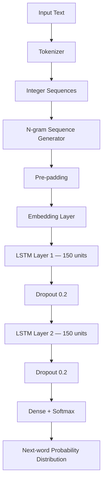
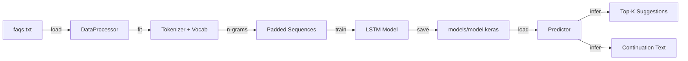

# Autofill Using ML

An end-to-end LSTM-based next-word prediction engine built with TensorFlow and Streamlit. The model is trained on a corpus of FAQ text and learns to predict the most likely next word(s) given any input phrase — similar to how autocomplete works in search engines and keyboards.

## Features

- **Real-time next-word suggestions** — top-K candidates with confidence scores
- **Multi-word text continuation** — generate full sentence completions
- **Temperature control** — tune between deterministic and creative output
- **Interactive Streamlit web UI** — click suggestions to autofill
- **Command-line interface** — train and predict from the terminal
- **Model persistence** — save and reload trained models without retraining
- **Dynamic architecture** — vocab size and sequence length inferred automatically from data
- **Training visualization** — accuracy and loss curves saved automatically

## Architecture



## Data Flow



## Project Structure

```
Autofill-using-ML/
├── src/
│   ├── data.py          # DataProcessor: tokenization, sequencing, serialization
│   ├── model.py         # build_model: LSTM architecture factory
│   └── predictor.py     # Predictor: inference with top-K and continuation
├── data/
│   └── faqs.txt         # Training corpus (FAQ-style sentences)
├── models/              # Saved artifacts after training (gitignored)
├── app.py               # Streamlit web application
├── train.py             # Training entry point (CLI)
├── predict.py           # Prediction entry point (CLI)
└── requirements.txt
```

## Installation

```bash
git clone https://github.com/punyamodi/next-word-prediction-lstm.git
cd next-word-prediction-lstm
pip install -r requirements.txt
```

## Usage

### 1. Train the Model

```bash
python train.py
```

With custom options:

```bash
python train.py --data data/faqs.txt --epochs 200 --embedding-dim 100 --lstm-units 150 --output-dir models
```

| Argument | Default | Description |
|---|---|---|
| `--data` | `data/faqs.txt` | Path to training text file |
| `--epochs` | `200` | Number of training epochs |
| `--embedding-dim` | `100` | Word embedding dimensions |
| `--lstm-units` | `150` | LSTM hidden units per layer |
| `--output-dir` | `models` | Directory for saved artifacts |

Training saves:
- `models/model.keras` — trained model weights
- `models/processor.pkl` — tokenizer and sequence metadata
- `models/training_curves.png` — accuracy and loss plots

### 2. Predict from the Command Line

```bash
python predict.py "what is machine learning"
```

```
Seed: what is machine learning
--------------------------------------------------
Continuation: what is machine learning a type of artificial intelligence that

Top 5 next-word suggestions:
  1. a                    (34.21%)
  2. used                 (18.05%)
  3. the                  (12.30%)
  4. an                   (9.14%)
  5. where                (6.88%)
```

With options:

```bash
python predict.py "how does" --words 8 --top-k 3 --temperature 0.8
```

| Argument | Default | Description |
|---|---|---|
| `--words` | `5` | Number of words to generate |
| `--top-k` | `5` | Number of next-word suggestions |
| `--temperature` | `1.0` | Sampling temperature |
| `--model` | `models/model.keras` | Path to model file |
| `--processor` | `models/processor.pkl` | Path to processor file |

### 3. Launch the Web App

```bash
streamlit run app.py
```

The web UI provides:

- A text input field for typing your seed phrase
- Real-time next-word buttons you can click to autofill
- A full sentence continuation panel
- A metrics grid showing top-5 candidate words with confidence
- Sidebar controls for temperature, number of suggestions, and generation length

## Training Data

The default training corpus (`data/faqs.txt`) contains FAQ-style questions and answers covering:

- Data science course information and program details
- Machine learning concepts and definitions
- NLP terminology (tokenization, embeddings, attention)
- LSTM and deep learning fundamentals
- Training concepts (epochs, batch size, optimizers, loss functions)

To use a custom dataset, replace `data/faqs.txt` with any plain-text file containing sentences separated by newlines, then re-run `python train.py`.

## Model Details

| Component | Configuration |
|---|---|
| Embedding | 100-dimensional dense vectors |
| LSTM Layer 1 | 150 units, returns sequences |
| Dropout | 0.2 after each LSTM layer |
| LSTM Layer 2 | 150 units |
| Output | Dense + Softmax over full vocabulary |
| Loss | Categorical cross-entropy |
| Optimizer | Adam |
| OOV Token | Handled with `<OOV>` token |

Vocabulary size and maximum sequence length are derived automatically from the training corpus, removing the need for any hardcoded constants.

## Temperature Parameter

| Temperature | Behavior |
|---|---|
| `< 1.0` | More confident, repetitive, deterministic |
| `= 1.0` | Default model probability distribution |
| `> 1.0` | More diverse, exploratory, unpredictable |

## Sample Interaction

```
Input:  "what is"
Output: "what is the course fee for data science"

Input:  "how does"
Output: "how does text generation work by training a model"

Input:  "machine learning"
Output: "machine learning uses traditional algorithms to learn from data"
```

## Future Work

- Transformer-based architecture (GPT-style) for higher quality completions
- Beam search decoding for better multi-word generation
- Support for fine-tuning on custom user data through the web UI
- Export model to ONNX for lightweight deployment
- REST API wrapper with FastAPI

